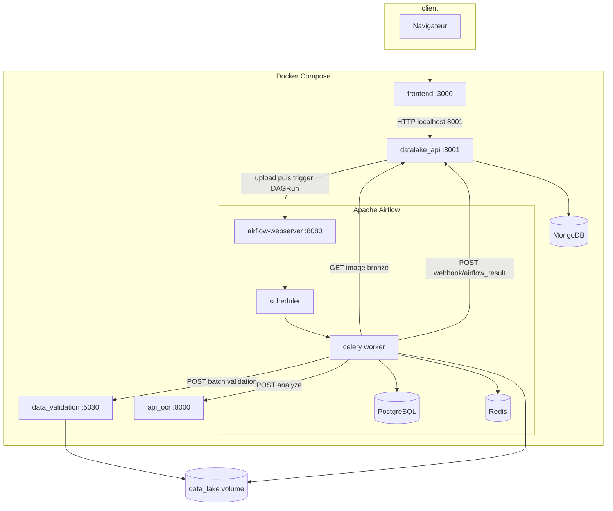

# Paperflow

Plateforme de traitement documentaire : upload vers un datalake (MongoDB), orchestration du pipeline OCR / validation par Apache Airflow, puis mise à jour des couches Bronze, Silver et Gold via webhook.

## Prérequis

- Docker et Docker Compose (plugin `docker compose`)
- Environnement Linux : définir `AIRFLOW_UID` pour éviter des fichiers créés en root dans `airflow/logs` (voir [documentation Airflow Docker](https://airflow.apache.org/docs/apache-airflow/stable/howto/docker-compose/index.html#setting-the-right-airflow-user)). Sous macOS, l’avertissement est en général acceptable sans variable.

## Démarrage rapide

À la racine du dépôt :

```bash
docker compose up -d --build
```

Attendre la fin du conteneur `airflow-init` (migrations + création de l’utilisateur web), puis vérifier que les services sont sains.

### Interface Airflow

- URL : [http://localhost:8080](http://localhost:8080)
- Identifiants par défaut : utilisateur `airflow`, mot de passe `airflow` (variables `_AIRFLOW_WWW_USER_*` dans `docker-compose.yaml`)

Les DAG sont **créés en pause** (`AIRFLOW__CORE__DAGS_ARE_PAUSED_AT_CREATION`). Dans l’UI, activer (unpause) le DAG `hackathon_flow_complet` avant de tester des uploads déclenchant le pipeline.

### Autres URLs utiles

| Service            | Port hôte | Rôle |
|--------------------|-----------|------|
| Frontend           | 3000      | Application web (Nginx) |
| API Datalake       | 8001      | FastAPI : upload, stockage, webhook |
| API OCR            | 8000      | Analyse d’images |
| API Data validation| 5030      | Croisement contexte / anomalies |
| MongoDB            | 27017     | Persistance datalake |

Le frontend appelle l’API datalake sur `http://localhost:8001` (voir `front/src/services/api.js`).

## Rôle d’Airflow dans ce projet

- **Exécuteur** : Celery (worker + broker Redis + métadonnées PostgreSQL).
- **DAG** : `hackathon_flow_complet` (`airflow/dags/main_pipeline.py`), sans planification (`schedule_interval=None`), déclenché à la demande.
- **Déclenchement** : après un upload réussi, l’API datalake (`app/routes/upload.py`) envoie une requête `POST` à l’API REST Airflow pour lancer une exécution avec une configuration (`conf`) contenant notamment `bronze_id`, `entrepriseId`, `siret_principal`, `nom_principal`.
- **Enchaînement des tâches** :
  1. Récupération de l’image Bronze depuis l’API datalake, puis appel OCR.
  2. Envoi des extractions à l’API de validation (batch + contexte entreprise).
  3. Branchement selon conformité, puis tâche unique de finalisation qui appelle `POST /webhook/airflow_result` sur l’API datalake pour mettre à jour Silver/Bronze et créer une entrée Gold si le statut est `VALIDE`.

Le répertoire `data_lake` est monté dans les conteneurs Airflow et dans `data_validation` pour un accès fichier partagé si besoin.

## Profils Compose optionnels

- `flower` : supervision Celery sur le port 5555 — `docker compose --profile flower up -d`
- `debug` : service `airflow-cli` pour exécuter des commandes `airflow` dans le stack

## Architecture



En résumé : le **navigateur** parle au **frontend**, qui appelle l’**API datalake**. L’upload insère Bronze/Silver puis déclenche **Airflow**. Le **worker** enchaîne **datalake**, **OCR** et **validation**, puis notifie à nouveau le **datalake** pour finaliser les statuts et la couche Gold.
